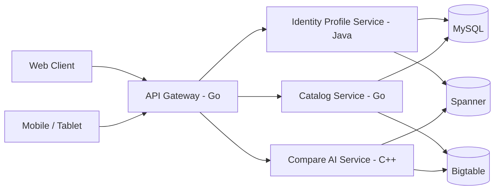

# Marketly System Design

## 1. Saytga qarab ajratilgan bounded contexts

### Identity and Profile
Hozirgi sayt funksiyalari:
- Gmail/email kiritish
- ism, familiya, telefon
- `Xaridor` yoki `Tadbirkor` roli
- admin login

Bu `identity-profile-java` servisga tushadi.

### Catalog and Feed
Hozirgi sayt funksiyalari:
- mahsulot qo'shish
- kategoriyalar
- xaridor feed sahifasi
- mahsulotlar ro'yxati

Bu `catalog-go` servisga tushadi.

### Compare Intelligence
Hozirgi sayt funksiyalari:
- 2 ta mahsulot tanlash
- "qaysi biri menga mos?" savoli
- AI tavsiya

Bu `compare-ai-cpp` servisga tushadi.

### Admin and Security
Hozirgi sayt funksiyalari:
- admin dashboard
- users / products ko'rish
- security on/off
- devtools-style panel

Bu `identity-profile-java` va `catalog-go` dan agregatsiya qilinadi, tashqaridan `api-gateway-go` orqali beriladi.

## 2. Traffic flow

## 3. Database responsibilities

### MySQL
- users
- profiles
- roles
- product core metadata
- admin settings

### Spanner
- user session states
- compare job state
- critical cross-service transactional data
- future order/payment orchestration

### Bigtable
- feed events
- clickstream
- compare history
- recommendation features
- product analytics timeline

## 4. Google Cloud mapping

- `Cloud Load Balancer` -> tashqi trafik
- `GKE` -> servislarni orkestratsiya qilish
- `Artifact Registry` -> image saqlash
- `Cloud Build` -> CI/CD
- `Secret Manager` -> DB va OAuth secretlar
- `Pub/Sub` -> async events

## 5. Site-to-service mapping

| Current route | Future owner |
|---|---|
| `/save-data` | identity-profile-java |
| `/save-profile` | identity-profile-java |
| `/save-final-user` | identity-profile-java |
| `/api/admin/login` | identity-profile-java |
| `/api/admin/dashboard` | api-gateway-go aggregate |
| `/add-product` | catalog-go |
| `/api/get-products` | catalog-go |
| `/api/save-compare` | compare-ai-cpp |
| `xaridor.html` compare block | compare-ai-cpp via gateway |

## 6. Recommended rollout

1. `api-gateway-go` ni birinchi qo'yish
2. `catalog-go` ni ajratish
3. `identity-profile-java` ni ajratish
4. `compare-ai-cpp` ni AI scoring service sifatida qo'shish
5. Bigtable/Spanner ni analytics + transactional state uchun bosqichma-bosqich ulash

